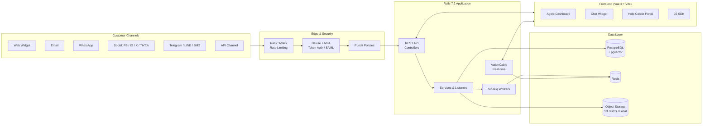

<div align="center">

# 🛡️ AegisDesk

### Customer-Obsessed Support Console · Design Thinking & Secure UX

**An open-source, self-hosted, omnichannel support desk — designed around the people who use it and hardened around the data it protects.**

<br/>

[](./LICENSE)
[](./.ruby-version)
[](./Gemfile)
[](./package.json)
[](./.nvmrc)
[](./docker-compose.yaml)
[](./config/sidekiq.yml)

[](https://github.com/YOUR_USERNAME/AegisDesk-Customer-Obsessed-Support-Console-Design-Thinking-Secure-UX/stargazers)
[](https://github.com/YOUR_USERNAME/AegisDesk-Customer-Obsessed-Support-Console-Design-Thinking-Secure-UX/network/members)
[](https://github.com/YOUR_USERNAME/AegisDesk-Customer-Obsessed-Support-Console-Design-Thinking-Secure-UX/issues)
[](./CONTRIBUTING.md)
[](https://github.com/YOUR_USERNAME/AegisDesk-Customer-Obsessed-Support-Console-Design-Thinking-Secure-UX/commits)

<br/>

[**🚀 Live Demo**](#-live-demo) ·
[**✨ Features**](#-features) ·
[**🧠 Design Thinking**](#-design-thinking-process) ·
[**🔐 Secure UX**](#-secure-ux-by-design) ·
[**⚡ Quick Start**](#-quick-start) ·
[**🏗️ Architecture**](#️-architecture) ·
[**🤝 Contributing**](#-contributing)

</div>

---


---

## 📖 Table of Contents

- [Overview](#-overview)
- [Live Demo](#-live-demo)
- [Features](#-features)
- [Design Thinking Process](#-design-thinking-process)
- [Secure UX by Design](#-secure-ux-by-design)
- [Architecture](#️-architecture)
- [Tech Stack](#️-tech-stack)
- [Project Structure](#-project-structure)
- [Quick Start](#-quick-start)
- [Configuration](#️-configuration)
- [Deployment](#-deployment)
- [Testing & Quality](#-testing--quality)
- [Roadmap](#️-roadmap)
- [Contributing](#-contributing)
- [Security Policy](#-security-policy)
- [License](#-license)
- [Acknowledgements](#-acknowledgements)

---

## 🎯 Overview

**AegisDesk** is a modern customer support console that puts the customer at the center of every interaction — and protects them while doing it. It unifies conversations from every channel into a single, fast inbox, then layers on automation, AI assistance, analytics, and a self-service help center.

The project is guided by two principles:

| Principle | What it means in practice |
|---|---|
| **Customer-obsessed** | Every screen is shaped by the agent's workflow and the customer's context: one inbox, full conversation history, instant canned replies, private notes, and satisfaction feedback loops. |
| **Secure by default** | Security is part of the interface, not an afterthought: multi-factor authentication, layered rate limiting, role-based policies, audit trails, and SAML SSO support. |

> **Why "Aegis"?** In mythology, the aegis is a shield. AegisDesk is a support desk built to shield customer data and agent focus at the same time.

---

## 🚀 Live Demo

> 🔧 **Replace the placeholders below with your own deployment once it's live.**

| Resource | Link |
|---|---|
| 🌐 Live app | `https://YOUR-DEPLOYMENT-URL` |
| 📚 Docs | `https://YOUR-DOCS-URL` |
| 🎥 Walkthrough video | `https://YOUR-VIDEO-URL` |

**Running locally?** The development seed creates a demo super-admin so you can explore immediately:

```text
Email:    john@acme.inc
Password: Password1!
```

> ⚠️ **Development only.** These credentials come from `db/seeds.rb`. Never use them in production, and change or delete the seeded account on any shared environment.

---

## ✨ Features

### 💬 Omnichannel Inbox
Centralize every customer conversation in one place. Channels implemented in this codebase (`app/models/channel`):

| Channel | Channel | Channel |
|---|---|---|
| 🌐 Website live chat widget | 📧 Email | 💚 WhatsApp |
| 📘 Facebook Messenger | 📸 Instagram | 🎵 TikTok |
| 🐦 Twitter / X | ✈️ Telegram | 💬 LINE |
| 📱 SMS (incl. Twilio) | 🔌 API channel | |

### 🤖 Captain — AI Agent for Support
AI-assisted responses to automate common queries and reduce agent workload, backed by vector search (`pgvector`) and the `ai-agents` / OpenAI integrations in the Gemfile.

### 📚 Help Center Portal
Publish articles, FAQs, and guides so customers can solve problems on their own and agents can focus on complex issues.

### 🤝 Collaboration & Productivity
- **Private notes & @mentions** for internal discussion
- **Labels**, **custom views**, and **filters** to organize the inbox
- **Canned responses** and **macros** for faster replies
- **Keyboard shortcuts** and a **command bar** for quick navigation
- **Auto-assignment**, **teams**, and **agent capacity management**
- **Automation rules** to scale repetitive workflows
- **Business hours** and **auto-responders** to set expectations
- **Multi-lingual** interface

### 🧑‍🤝‍🧑 Customer Data & Segmentation
- Contact profiles with full interaction history
- Contact segments, notes, and **custom attributes**
- **Pre-chat forms** to capture context before a conversation begins
- Proactive **campaigns**
- Company records and CSV **data import**

### 🔗 Integrations
- **Slack** — manage conversations from Slack
- **Dialogflow** — chatbot automation
- **Shopify** — view customer orders inside the console
- **Linear** — create and manage tickets
- **Google Translate** — real-time message translation
- **Dashboard Apps** — embed internal tools
- **Webhooks** and **agent bots** for custom workflows
- **Web Push** / **FCM** notifications

### 📊 Reports & Insights
- Live view of ongoing conversations
- Conversation, agent, inbox, label, and team reports
- **CSAT** surveys and reports
- Downloadable reports for offline analysis

---

## 🧠 Design Thinking Process

AegisDesk's product approach follows the five stages of Design Thinking. The table maps each stage to concrete capabilities in the console.

> 📝 *This section describes the product philosophy and how it maps to shipped features. Add your own research artifacts (personas, journey maps, interview notes) under `docs/` and link them here to make it fully yours.*

| Stage | Question we ask | How it shows up in AegisDesk |
|:---:|---|---|
| **1. Empathize** | *Who is on the other side of the conversation?* | Contact profiles, conversation history, custom attributes, and pre-chat forms surface customer context right where the agent replies. |
| **2. Define** | *What is the real problem to solve?* | Agents lose time switching tools and re-asking questions → unified inbox, labels, filters, and custom views. Customers want fast, accurate answers → Help Center + Captain AI. |
| **3. Ideate** | *How might we remove friction?* | Keyboard shortcuts, command bar, canned responses, macros, automation rules, and auto-assignment. |
| **4. Prototype** | *Can we make it tangible quickly?* | A dedicated component library with [Histoire](https://histoire.dev) stories (`pnpm story:dev`) lets designers and engineers iterate on UI in isolation. |
| **5. Test** | *Did it actually help?* | CSAT surveys, agent/inbox/team reports, and live view close the loop with measurable feedback. |

### 🧑‍💻 Who we design for

| Persona | Needs | Supported by |
|---|---|---|
| **Support Agent** | Speed, context, low cognitive load | Unified inbox, shortcuts, canned replies, private notes |
| **Team Lead / Administrator** | Visibility, routing, control | Reports, teams, automation, capacity management, roles |
| **Customer** | Quick resolution, privacy, choice of channel | Omnichannel widget, Help Center, CSAT, secure data handling |
| **Developer / Integrator** | Extensibility | REST API, webhooks, agent bots, dashboard apps, JS SDK |

---

## 🔐 Secure UX by Design

Good security *feels* effortless to the people using it. The codebase includes the following controls (verified in source):

### Authentication & Access
| Control | Details | Where to look |
|---|---|---|
| **Multi-factor authentication (MFA/2FA)** | TOTP-based via `devise-two-factor`, with setup, verification, and trusted-device flows | `app/services/mfa/`, `app/controllers/api/v1/profile/mfa_controller.rb` |
| **Token-based API auth** | `devise_token_auth` with per-user access tokens | `config/initializers/devise_token_auth.rb` |
| **SAML SSO** | `omniauth-saml` support | `config/initializers/omniauth.rb` |
| **Role-based authorization** | Roles (`agent`, `administrator`) plus Pundit policies for 25+ resources | `app/models/account_user.rb`, `app/policies/` |

### Abuse Protection (Rack::Attack)
Layered throttling in `config/initializers/rack_attack.rb`:

| Surface | Limit |
|---|---|
| Global requests per IP | 3000 / minute (override with `RACK_ATTACK_LIMIT`) |
| Login (per IP) | 5 / 5 min |
| Login (per email) | 10 / 15 min |
| Super-admin login (per IP / per email) | 5 / 5 min · 5 / 15 min |
| Password reset (per IP / per email) | 5 / 30 min · 5 / 1 hr |
| Confirmation resend (per IP / per email) | 5 / 30 min · 5 / 1 hr |
| MFA verification (per IP) | 5 / minute |
| MFA login & setup (per IP / token) | 10 / minute |
| Account signup (per IP) | 5 / 30 min |

Trusted IPs can be safelisted with `RACK_ATTACK_ALLOWED_IPS`, and health checks bypass throttling.

### Data Integrity & Observability
- **Audit trail** via the `audited` gem
- **CSV injection protection** via `csv-safe` on exports
- **Parameter filtering** in logs (`filter_parameter_logging.rb`)
- **Static analysis** with Brakeman and `bundler-audit` (see `.bundler-audit.yml`)
- **Error monitoring** with Sentry (optional) and structured logging with Lograge
- **`ENABLE_ACCOUNT_SIGNUP=false`** by default in `.env.example`, so new deployments aren't open to public sign-up

### Secure UX Principles Applied
1. **Progressive friction** — stricter checks on risky actions (login, reset, MFA), none on routine work.
2. **Clear feedback** — rate-limit and MFA flows return actionable states instead of silent failures.
3. **Least privilege** — agents see what they need; administrators manage the rest.
4. **Secure defaults** — conservative `.env.example` values; secrets never committed.
5. **Fail safe** — throttles fail open on unparseable input while the per-IP limit still applies.

---

## 🏗️ Architecture



---

## 🛠️ Tech Stack

| Layer | Technology |
|---|---|
| **Backend** | Ruby 3.4.4 · Rails 7.2 · Sidekiq 7 · ActionCable |
| **Frontend** | Vue 3 · Vuex & Pinia · Vue Router 4 · Vue I18n · Tailwind CSS 3 · Vite 6 |
| **Database** | PostgreSQL (pgvector) · Redis |
| **Auth & Security** | Devise · devise-two-factor · devise_token_auth · OmniAuth SAML · Pundit · Rack::Attack |
| **AI** | `ruby-openai` · `ai-agents` · `pgvector` / `neighbor` |
| **Storage** | Local · AWS S3 · Google Cloud Storage (Active Storage) |
| **Testing** | RSpec · Vitest · Histoire (component stories) |
| **Quality** | RuboCop · ESLint · Prettier · Brakeman · bundler-audit · Husky · Qlty |
| **DevOps** | Docker · Docker Compose · CircleCI · GitHub Actions · Dev Containers / Codespaces |

---

## 📁 Project Structure

```text
.
├── app/
│   ├── controllers/        # REST API & web controllers
│   ├── models/             # Domain models (incl. 11 channel types)
│   ├── policies/           # Pundit authorization policies
│   ├── services/           # Business logic (MFA, messaging, integrations…)
│   ├── jobs/               # Sidekiq background jobs
│   └── javascript/
│       ├── dashboard/      # Agent console (Vue 3)
│       ├── widget/         # Customer-facing live chat widget
│       ├── portal/         # Help Center portal
│       ├── survey/         # CSAT survey UI
│       ├── sdk/            # Embeddable JS SDK
│       ├── design-system/  # Shared design tokens & styles
│       └── superadmin_pages/
├── config/                 # Rails config, initializers (rack_attack, devise…)
├── db/                     # Migrations & seeds
├── enterprise/             # Enterprise-licensed modules (separate license)
├── lib/                    # Shared Ruby libraries
├── spec/                   # RSpec suite (~950 spec files)
├── swagger/                # OpenAPI definitions
├── theme/                  # Color & icon tokens
├── docker/                 # Dockerfiles & entrypoints
├── deployment/             # Linux systemd / nginx deployment assets
├── .github/                # CI workflows, issue & PR templates, screenshots
└── docs/                   # Engineering notes
```

---

## ⚡ Quick Start

### Prerequisites

| Tool | Version |
|---|---|
| Ruby | `3.4.4` (see `.ruby-version`) |
| Node.js | `24.x` (see `.nvmrc`) |
| pnpm | `10.x` |
| PostgreSQL | 16+ with the `pgvector` extension |
| Redis | any recent version |
| Overmind (or Foreman) | for running the dev processes |

### Option A — Local development

```bash
# 1. Clone
git clone https://github.com/YOUR_USERNAME/AegisDesk-Customer-Obsessed-Support-Console-Design-Thinking-Secure-UX.git
cd AegisDesk-Customer-Obsessed-Support-Console-Design-Thinking-Secure-UX

# 2. Configure environment
cp .env.example .env
#   → edit .env: set SECRET_KEY_BASE, POSTGRES_*, REDIS_URL, FRONTEND_URL

# 3. Install Ruby & JS dependencies
make setup            # bundle install + pnpm install

# 4. Prepare the database (create, migrate, seed)
make db

# 5. Start Rails, Sidekiq, and Vite together
make run              # uses Overmind + Procfile.dev
```

Then open **http://localhost:3000**.

| Command | Purpose |
|---|---|
| `make run` | Start backend (`:3000`), Sidekiq worker, and Vite dev server |
| `make force_run` | Clean up stale processes/sockets, then start |
| `make console` | Open a Rails console |
| `make db_reset` | Drop, recreate, and reseed the database |
| `make debug` / `make debug_worker` | Attach to the backend / worker process |

### Option B — Docker Compose

```bash
cp .env.example .env
# Edit .env, then:
docker compose up
```

A production-oriented stack (Rails, Sidekiq, `pgvector/pgvector:pg16`, Redis) is provided in `docker-compose.production.yaml`.

### Option C — Dev Container / GitHub Codespaces

Open the repository in VS Code and choose **"Reopen in Container"**, or launch a Codespace. Configuration lives in `.devcontainer/`.

---

## ⚙️ Configuration

All configuration is environment-driven via `.env` (see [`.env.example`](./.env.example) for the full, documented list). Key variables:

| Variable | Description |
|---|---|
| `SECRET_KEY_BASE` | Long random secret for signing sessions/tokens. **Required.** |
| `FRONTEND_URL` | Public URL of your deployment |
| `FORCE_SSL` | Set to `true` in production |
| `ENABLE_ACCOUNT_SIGNUP` | Allow public account creation (`false` recommended) |
| `POSTGRES_HOST` / `POSTGRES_*` | Database connection |
| `REDIS_URL` | Redis connection (Sidekiq, ActionCable, rate limiting) |
| `ACTIVE_STORAGE_SERVICE` | `local`, `amazon`, `google`, … |
| `RACK_ATTACK_LIMIT` | Global requests/minute/IP |
| `RACK_ATTACK_ALLOWED_IPS` | Comma-separated safelist |
| `SENTRY_DSN` | Optional error monitoring |
| `LOG_LEVEL` | `info` by default |

Generate a strong secret:

```bash
bundle exec rails secret
```

---

## 🌍 Deployment

| Target | How |
|---|---|
| **Docker** | `docker compose -f docker-compose.production.yaml up -d` |
| **Linux VM (systemd + nginx)** | Assets in `deployment/` (service units and `nginx_chatwoot.conf`) |
| **Heroku** | `app.json` is included for template-based deploys |
| **Clever Cloud** | Config in `clevercloud/` |
| **Kubernetes** | Build from `docker/Dockerfile` and supply Postgres + Redis |

**Production checklist**

- [ ] Strong, unique `SECRET_KEY_BASE`
- [ ] `FORCE_SSL=true` and TLS terminated at your proxy
- [ ] `ENABLE_ACCOUNT_SIGNUP=false` unless you intend open registration
- [ ] Seeded demo user removed or password changed
- [ ] Managed PostgreSQL with backups, plus persistent Redis
- [ ] Object storage (S3/GCS) configured for attachments
- [ ] `RACK_ATTACK_ALLOWED_IPS` set for trusted infrastructure
- [ ] MFA enabled for all administrators
- [ ] Error monitoring (`SENTRY_DSN`) configured

---

## 🧪 Testing & Quality

```bash
# Backend (RSpec)
bundle exec rspec

# Frontend (Vitest)
pnpm test
pnpm test:coverage

# Linting
bundle exec rubocop
pnpm eslint

# Security scanning
bundle exec brakeman
bundle exec bundle-audit check --update

# Component library (Histoire)
pnpm story:dev
```

**Continuous integration** (`.github/workflows/` and `.circleci/`) covers CE test runs, a dedicated MFA test workflow, frontend lint & test, bundle size limits, Docker build verification, PR linting, and nightly installer checks. Husky pre-commit hooks keep style consistent locally.

---

## 🗺️ Roadmap

- [ ] Publish Design Thinking research artifacts (personas, journey maps) under `docs/`
- [ ] Accessibility audit & documented conformance report
- [ ] Hosted public demo with resettable sandbox data
- [ ] Expanded Secure-UX guide (security UX patterns & copy guidelines)
- [ ] Additional analytics for CSAT trends and first-response time
- [ ] More Help Center themes

Have an idea? [Open a feature request](../../issues/new/choose).

---

## 🤝 Contributing

Contributions of all kinds are welcome — code, design, docs, translations, and bug reports.

1. **Fork** the repository
2. **Create a branch**: `git checkout -b feat/your-feature`
3. **Commit** using clear, conventional messages
4. **Run** the linters and tests locally
5. **Open a Pull Request** against the base branch using the PR template

Please read [`CONTRIBUTING.md`](./CONTRIBUTING.md) and our [`CODE_OF_CONDUCT.md`](./CODE_OF_CONDUCT.md) first. Issue templates for bugs and feature requests are in `.github/ISSUE_TEMPLATE/`.

---

## 🔒 Security Policy

Found a vulnerability? **Please don't open a public issue.** Follow the process in [`SECURITY.md`](./SECURITY.md) and report privately through GitHub Security Advisories on this repository.

Areas of particular interest: remote code execution, SQL injection, authentication bypass, privilege escalation, XSS, CSRF, and unauthorized admin actions. Please test only against a self-hosted instance.

---

## 📄 License

This project is released under the **MIT License** — see [`LICENSE`](./LICENSE).

Content under the `enterprise/` directory (if present) is covered by its own license in [`enterprise/LICENSE`](./enterprise/LICENSE).

---

## 🙏 Acknowledgements

AegisDesk is built on the shoulders of the open-source **[Chatwoot](https://github.com/chatwoot/chatwoot)** project (© 2017–2026 Chatwoot Inc., MIT License). Huge thanks to the Chatwoot maintainers and the wider contributor community whose work makes this possible.

Also powered by the incredible Ruby on Rails, Vue.js, PostgreSQL, Redis, Sidekiq, and Vite ecosystems.

---

<div align="center">

**If AegisDesk helps you, please consider giving it a ⭐**

Made with care for support teams and the customers they serve.

[⬆ Back to top](#️-aegisdesk)

</div>
